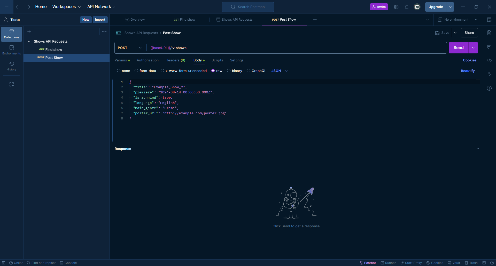
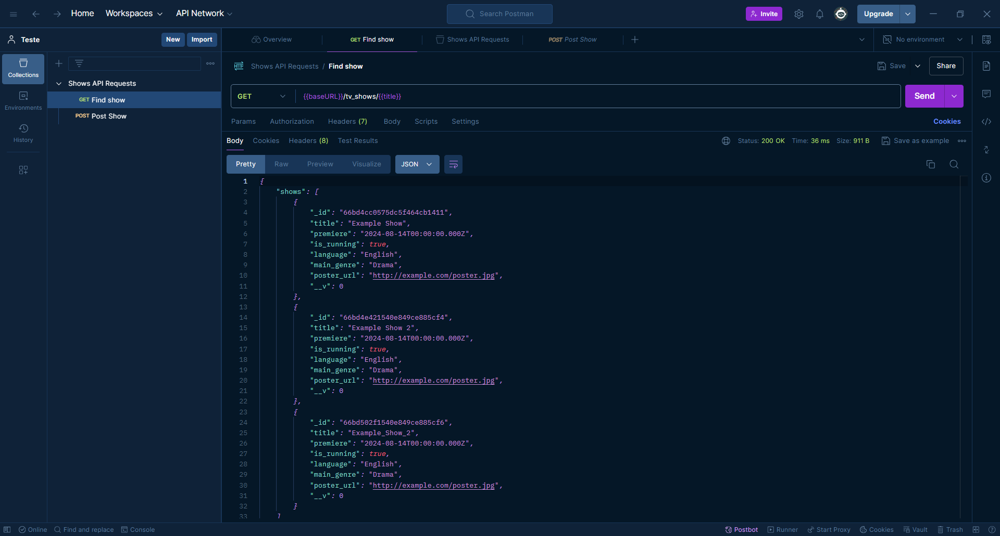

# Show API

## Introdução

A **Show API** é uma aplicação desenvolvida para gerenciar e consultar informações sobre séries de TV. Utilizando Node.js e Express para o servidor, MongoDB para o banco de dados e Docker para a contenção do ambiente, esta API permite que você adicione novas séries e busque séries existentes com base em seus títulos.

## Desenvolvimento

### Pré-requisitos

Certifique-se de ter os seguintes softwares instalados:

- [Node.js](https://nodejs.org/) (versão 14 ou superior)
- [MongoDB](https://www.mongodb.com/try/download/community) (ou utilize o MongoDB Atlas para um banco de dados na nuvem)
- [Docker](https://www.docker.com/products/docker-desktop) (opcional, para ambiente de desenvolvimento conteinerizado)
- [Postman](https://www.postman.com/) (para testar os endpoints da API)

### Configuração do Projeto

1. **Clone o Repositório**

   ```sh
   git clone https://github.com/seuusuario/seurepositorio.git
   cd seurepositorio
   
2. **Instale as Dependências**

   ```sh
   npm install

3. **Configuração do Banco de Dados com Docker (opcional)**
   
   Se estiver usando Docker para o MongoDB, você pode iniciar um contêiner MongoDB com:
   
   ```sh
   docker-compose up -d

5. **Configuração do Banco de Dados Local**
   
   Se não estiver usando Docker, inicie o MongoDB localmente e certifique-se de que o serviço está rodando na porta padrão (27017).
   
6. **Inicie o Servidor**
      
   ```sh
   npm run dev

  - Isso iniciará o servidor na porta 3000 por padrão.

### Comandos e Passos para Testar

1. **Adicionar uma Nova Série**
   
   Utilize o Postman para enviar uma requisição POST para http://localhost:3000/shows com o corpo JSON:

    ```json
   {
     "title": "Example Show",
     "isRunning": true,
     "language": "English",
     "mainGenre": "Drama",
     "posterUrl": "http://example.com/poster.jpg"
   }
    
  - Resposta esperada:

    ```json
    {
      "id": "id_da_nova_serie"
    }

2. **Buscar Séries**
   
   Envie uma requisição GET para http://localhost:3000/shows/Example_Show para encontrar todas as séries cujo título contenha "Example_Show".

  - Resposta esperada:

    ```json
    {
    "shows": [
      {
        "_id": "id_da_serie",
        "title": "Example Show",
        "isRunning": true,
        "language": "English",
        "mainGenre": "Drama",
        "posterUrl": "http://example.com/poster.jpg",
        "__v": 0
      }
      ]
    }

## Conclusão

A Show API foi criada para fornecer uma maneira simples de adicionar e buscar informações sobre séries de TV.

### Imagens do Uso

- Adicionando uma Série
  
  

- Buscando Séries
  
  

### Motivo da Criação

A API foi desenvolvida como um projeto educacional para demonstrar o uso de Express e MongoDB em uma aplicação real. Ela ilustra a capacidade de criar, armazenar e consultar dados de forma eficiente, fornecendo uma base para futuros projetos mais complexos.


Se você tiver dúvidas ou precisar de assistência adicional, sinta-se à vontade para abrir uma issue no repositório ou entrar em contato.


### Notas:

- **Links e Comandos**: Ajuste os links e comandos conforme a configuração real do seu projeto.
- **Configurações Específicas**: Adapte as instruções de configuração e execução de acordo com as necessidades do seu projeto e ambiente.

Se precisar de mais detalhes ou ajustes, me avise!
